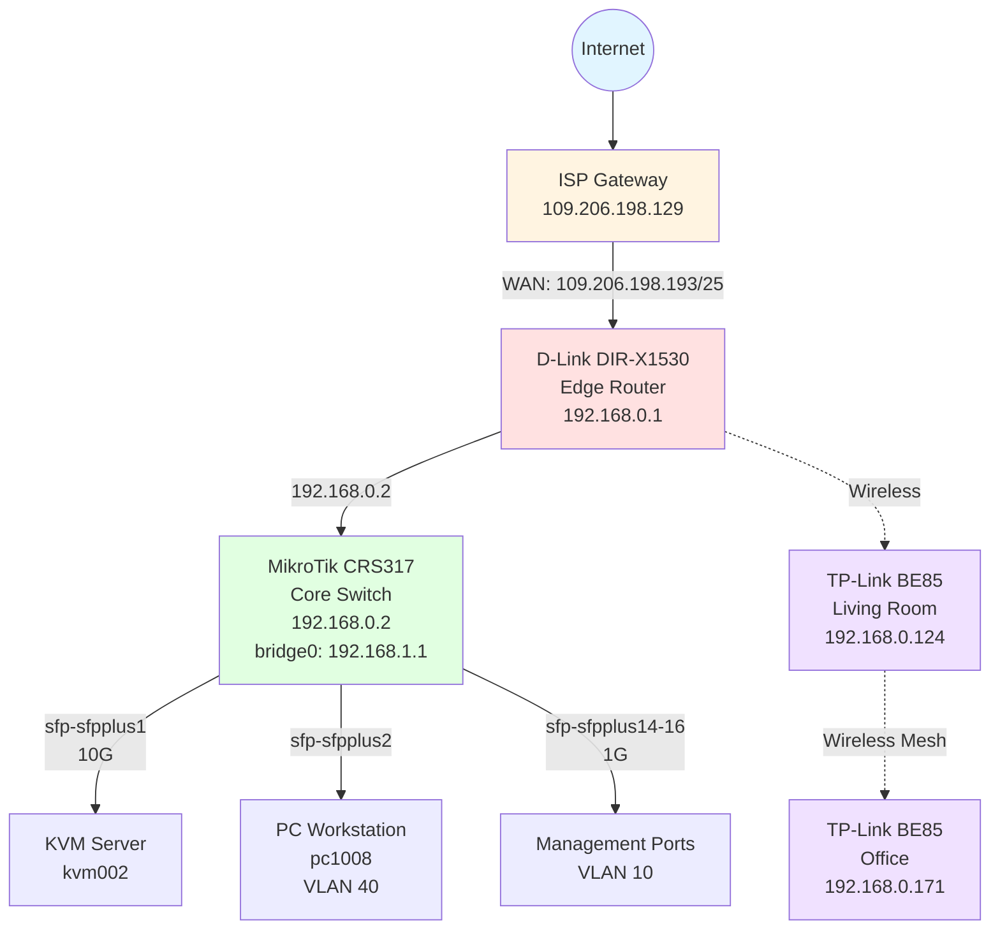
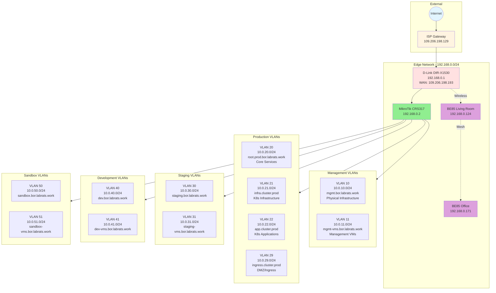
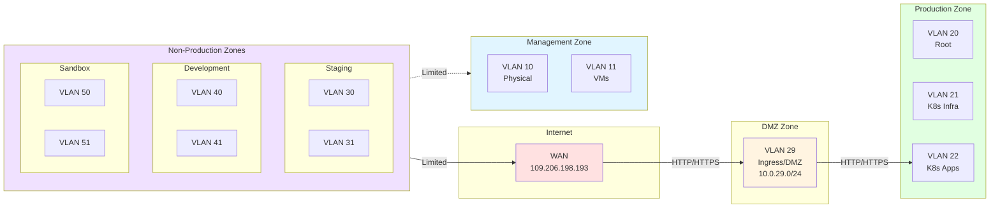
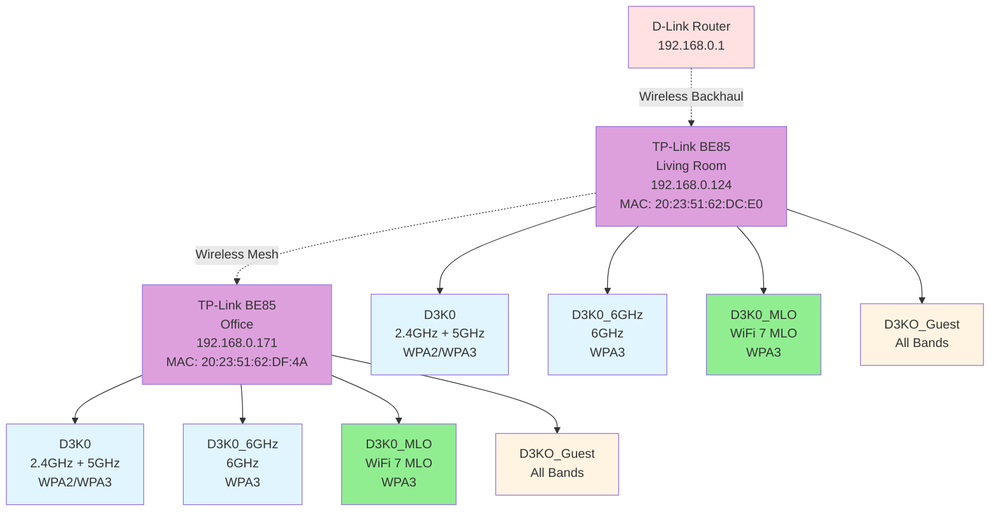

# Homelab Network Diagram

## Overall Network Topology

## Detailed Network Architecture

## VLAN Security Zones

## WiFi Network Architecture

## Network Address Summary

### Edge Network (192.168.0.0/24)
- **192.168.0.1** - D-Link DIR-X1530 (Edge Router)
- **192.168.0.2** - MikroTik CRS317 (Core Switch) - DHCP reservation
- **192.168.0.100-199** - DHCP pool
- **192.168.0.124** - TP-Link BE85 Living Room
- **192.168.0.171** - TP-Link BE85 Office

### MikroTik Internal Networks

#### Management VLANs
- **10.0.10.0/24** - VLAN 10 (Physical infrastructure management)
- **10.0.11.0/24** - VLAN 11 (Management VMs)

#### Production VLANs
- **10.0.20.0/24** - VLAN 20 (Production root services)
- **10.0.21.0/24** - VLAN 21 (Kubernetes infrastructure)
- **10.0.22.0/24** - VLAN 22 (Kubernetes applications)
- **10.0.29.0/24** - VLAN 29 (DMZ/Ingress)

#### Staging VLANs
- **10.0.30.0/24** - VLAN 30 (Staging environment)
- **10.0.31.0/24** - VLAN 31 (Staging VMs)

#### Development VLANs
- **10.0.40.0/24** - VLAN 40 (Development workstations)
- **10.0.41.0/24** - VLAN 41 (Development VMs)

#### Sandbox VLANs
- **10.0.50.0/24** - VLAN 50 (Sandbox environment)
- **10.0.51.0/24** - VLAN 51 (Sandbox VMs)

## Traffic Flow Rules

### Internet Access
- **VLAN 29 (DMZ)**: Inbound HTTP/HTTPS allowed
- **VLAN 40 (Dev)**: Outbound HTTP/HTTPS only
- **VLAN 50 (Sandbox)**: Outbound HTTP/HTTPS only
- **Other VLANs**: No direct internet access (isolated)

### Inter-VLAN Communication
- **Default Policy**: DENY (all VLANs isolated)
- **VLAN 29 → VLAN 22**: HTTP/HTTPS (ingress to K8s apps)
- **VLAN 30/31 → VLAN 10/11**: SSH, RDP, HTTP, HTTPS (staging to management)
- **VLAN 40 → VLAN 10**: SSH, HTTP, HTTPS, Proxmox (dev to management)
- **VLAN 40 → VLAN 41**: SSH, HTTP, HTTPS (dev to dev VMs)
- **VLAN 50/51 → VLAN 10/11**: Limited management access

### Services Allowed to All VLANs
- DNS (to gateway)
- NTP (to gateway)
- DHCP (to gateway)
- ICMP (ping)

## Physical Connections

### MikroTik CRS317 Port Assignments
- **ether1**: Uplink to D-Link router (192.168.0.2/24)
- **sfp-sfpplus1**: KVM server (10G, PVID 10, tagged all VLANs)
- **sfp-sfpplus2**: PC workstation pc1008 (PVID 40, tagged all VLANs)
- **sfp-sfpplus14-16**: Management ports (1G, PVID 10)
- **sfp-sfpplus3-13**: Available

## VPN Access

### WireGuard VPN
- **Interface**: back-to-home-vpn
- **Port**: 55515
- **Users**: 5 (thopi, glinet, LAPTOP-MUJJBT1D, Pixel4, gh_action_01)
- **Access**: Full LAN access for all users

## Infrastructure as Code

### MikroTik Core Switch Management

The MikroTik CRS317 core switch is managed using **Terraform** with configuration stored in version control:

- **Repository**: [labrats-work/bor.infra.network](https://github.com/labrats-work/bor.infra.network)
- **Method**: Declarative Infrastructure as Code (IaC)
- **Provider**: Terraform MikroTik provider
- **Benefits**:
  - Version-controlled network configuration
  - Automated deployment and updates
  - Configuration drift detection
  - Reproducible infrastructure
  - Full audit trail via Git history
  - Disaster recovery capability

### Configuration Management

All MikroTik configuration is managed through Terraform resources including:
- VLANs and network interfaces
- Firewall rules (input, forward, NAT)
- DHCP servers and pools
- DNS configuration
- WireGuard VPN
- Routing rules
- Address lists

Manual changes to the router are discouraged as they will be overwritten on next Terraform apply.

## Security Model

### Defense-in-Depth Strategy
1. **Edge Security**: NAT at D-Link router
2. **Network Segmentation**: 12 isolated VLANs
3. **Zone Isolation**: Management, Production, Staging, Dev, Sandbox
4. **DMZ**: Separate ingress zone (VLAN 29)
5. **Firewall**: Default deny with explicit allow rules
6. **VPN**: Secure remote access via WireGuard

### Zero Trust Principles
- All inter-VLAN traffic blocked by default
- Explicit allow rules for required services only
- Production isolated from non-production
- DMZ restricted to HTTP/HTTPS only
- Management access restricted to trusted networks

---
*Last Updated: 2025-11-01*
*Network documentation generated from homelab configuration*

**Note**: The MikroTik CRS317 core switch configuration is managed via Terraform in the [bor.infra.network](https://github.com/labrats-work/bor.infra.network) repository. This ensures all network configuration is version-controlled and reproducible.
